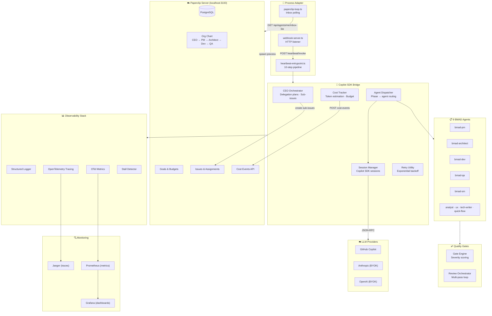
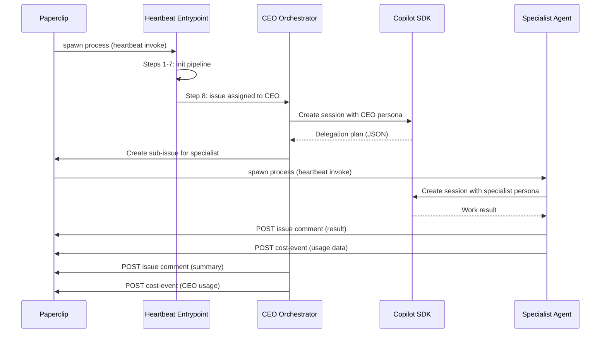

# BMAD Copilot Factory

> Autonomous Software Building Factory — Paperclip orchestration + GitHub Copilot SDK agents + BMAD Method

[]()
[]()
[]()
[]()

## What is this?

A 3-layer autonomous software development system:

| Layer | Tool | Role |
|-------|------|------|
| **Orchestration** | [Paperclip](https://github.com/paperclipai/paperclip) | Org charts, goals, budgets, governance, heartbeats |
| **Methodology** | [BMAD Method](https://github.com/bmad-code-org/BMAD-METHOD) | Sprint lifecycle, story creation, adversarial code review, quality gates |
| **Execution** | [Copilot SDK](https://github.com/github/copilot-sdk) | Programmable agent runtime: custom agents, tools, MCP, skills |

The factory reads assigned issues from Paperclip, dispatches them to specialized AI agents (PM, Architect, Developer, QA, Scrum Master), enforces quality gates with severity-scored adversarial review, and advances work through the BMAD lifecycle — all autonomously.

Paperclip uses a **push model**: it spawns agent processes via heartbeats, each process runs the full 10-step pipeline (identify → resolve role → check inbox → dispatch → report costs → cleanup), and reports results back as issue comments. A **CEO orchestrator** analyzes incoming issues, builds delegation plans, and creates sub-issues for specialist agents.

## Architecture



## Quick Start

### Prerequisites

- **Node.js** 20+ (tested on 25.8.1)
- **pnpm** 10+
- **GitHub Copilot CLI** (`gh copilot --version`)
- **GitHub Copilot subscription**
- **Docker** (optional — for Paperclip and observability stack)

### Install

```bash
pnpm install
```

### Run (dry-run — no SDK calls)

```bash
pnpm start:dry-run
```

### Run (live — requires Copilot CLI)

```bash
pnpm start                              # Process all actionable stories
pnpm start -- --story STORY-001         # Process a single story
pnpm start -- --dispatch dev-story S-1  # Run one phase for one story
pnpm start -- --status                  # Health check + sprint summary
```

### Run with observability

```bash
pnpm observability:up                   # Start Jaeger + Prometheus + Grafana
pnpm start:otel                         # Run factory with telemetry export
open http://localhost:3000              # Grafana dashboards (admin/bmad)
open http://localhost:16686             # Jaeger trace explorer
```

### Run with Paperclip

```bash
./scripts/setup-paperclip.sh            # Clone Paperclip + apply local patches
docker compose up -d                    # Start Paperclip + PostgreSQL
npx tsx scripts/setup-paperclip-company.ts  # Create company, agents, org chart
pnpm start:paperclip                    # Run inbox-polling integration loop
# Alternative (no Docker):  npx paperclipai onboard --yes
```

### Run with webhook server (production mode)

```bash
PAPERCLIP_MODE=webhook npx tsx src/webhook-server.ts   # Start HTTP listener on :4200
# Paperclip sends POST /heartbeat/invoke → BMAD pipeline
```

### Run tests

```bash
pnpm test                               # 480 tests, ~3.5s
pnpm test:watch                         # Watch mode
pnpm typecheck                          # TypeScript strict check
```

## CLI Modes

| Mode | Command | Description |
|------|---------|-------------|
| Sprint cycle | `pnpm start` | Process all actionable stories in one cycle |
| Single story | `pnpm start -- --story STORY-001` | Process one story only |
| Single dispatch | `pnpm start -- --dispatch dev-story S-001` | Run one phase for one story |
| Dry run | `pnpm start:dry-run` | Full pipeline, no SDK calls |
| Status | `pnpm start:status` | Health check + sprint summary |
| Paperclip | `pnpm start:paperclip` | Inbox-polling integration (push model) |
| Webhook | `npx tsx src/webhook-server.ts` | HTTP server for Paperclip push callbacks |
| With OTel | `pnpm start:otel` | Sprint cycle with telemetry export |
| MCP server | `pnpm mcp:sprint` | Expose sprint data via MCP |
| Setup company | `npx tsx scripts/setup-paperclip-company.ts` | Provision agents & org chart in Paperclip |
| Update pricing | `npx tsx scripts/update-model-pricing.ts` | Manage LLM model pricing data |
| E2E test | `npx tsx scripts/e2e-test.ts` | End-to-end pipeline test (smoke/full/autonomous) |

## Project Structure

```
src/
├── agents/              # 9 BMAD agent persona definitions
│   ├── types.ts         # BmadAgent interface {name, displayName, description, prompt}
│   ├── registry.ts      # Agent lookup: allAgents[], getAgent(name)
│   ├── developer.ts     # "Amelia" — bmad-dev — story implementation, TDD
│   ├── product-manager.ts # "John" — bmad-pm — PRD creation, requirements
│   ├── architect.ts     # "Winston" — bmad-architect — system design
│   ├── qa-engineer.ts   # "Quinn" — bmad-qa — adversarial code review
│   ├── scrum-master.ts  # "Bob" — bmad-sm — sprint planning
│   └── ...              # analyst, tech-writer, ux-designer, quick-flow
│
├── tools/               # Copilot SDK defineTool() implementations
│   ├── create-story.ts  # create_story — markdown + Paperclip issue creation
│   ├── code-review.ts   # code_review + code_review_result — adversarial review
│   ├── issue-status.ts  # issue_status — read/update/reassign Paperclip issues
│   ├── sprint-status.ts # [DEPRECATED] sprint-status.yaml CRUD
│   ├── tool-context.ts  # Thread-safe workspace + story context injection
│   └── types.ts         # Tool type re-exports from Copilot SDK
│
├── adapter/             # Paperclip ↔ Copilot SDK bridge layer
│   ├── session-manager.ts    # CopilotClient lifecycle, session create/resume/persist
│   ├── agent-dispatcher.ts   # Phase → agent routing, model selection, prompt building
│   ├── ceo-orchestrator.ts   # CEO delegation: analyze → plan → sub-issues → summarize
│   ├── lifecycle.ts          # ★ Single source of truth for ALL issue state transitions
│   ├── issue-reassignment.ts # SM→Dev→QA handoff protocol, checkout release
│   ├── health-check.ts       # 5-probe system readiness check
│   ├── paperclip-client.ts   # Paperclip REST API client (~20 endpoints)
│   ├── paperclip-loop.ts     # Inbox-polling integration loop (dev mode)
│   ├── heartbeat-handler.ts  # Issue → dispatcher bridge, context enrichment
│   ├── reporter.ts           # Results → Paperclip issue comments
│   ├── retry.ts              # Exponential backoff with jitter
│   └── sprint-runner.ts      # [DEPRECATED] old YAML-based lifecycle engine
│
├── quality-gates/       # BMAD adversarial review system
│   ├── types.ts         # Severity, FindingCategory, ReviewFinding, GateResult
│   ├── engine.ts        # Pure gate evaluation: scoring, verdicts (PASS/FAIL/ESCALATE)
│   ├── review-orchestrator.ts  # Multi-pass review loop with fix cycles
│   └── tool.ts          # quality_gate_evaluate — structured findings evaluation
│
├── observability/       # Production observability stack
│   ├── logger.ts        # Structured JSON/human-readable logger with level filtering
│   ├── tracing.ts       # OpenTelemetry distributed tracing to Jaeger
│   ├── metrics.ts       # OTel metrics: 8 instruments (counters, histograms, gauges)
│   ├── cost-tracker.ts  # Token estimation, 34 model pricing entries, budget tracking
│   └── stall-detector.ts # Phase timeout monitoring + escalation
│
├── config/              # Runtime configuration
│   ├── config.ts        # loadConfig() — 30+ env vars → BmadConfig
│   ├── model-strategy.ts # Complexity → model tier routing (fast/standard/powerful)
│   └── role-mapping.ts  # Paperclip agent → BMAD persona + skills mapping
│
├── skills/              # Copilot SDK skill prompts
│   ├── bmad-methodology/ # BMAD method skill definitions
│   └── quality-gates/   # Quality gate skill prompts
│
├── mcp/                 # MCP server (VS Code integration)
│   └── bmad-sprint-server/
│       ├── index.ts     # Stdio MCP server entry
│       └── tools.ts     # 5 tool handlers
│
├── utils/               # Shared utilities
│   └── comment-format.ts # Markdown linkification for Paperclip URLs
│
├── sandbox/             # Development/testing scripts (hello-copilot, test-agent, etc.)
├── heartbeat-entrypoint.ts  # ★ 10-step pipeline entry point for Paperclip processes
├── webhook-server.ts        # HTTP server for Paperclip push-mode callbacks (:3200)
├── health.ts                # Health check HTTP handler (/health)
└── index.ts                 # Main entry point + CLI parsing

scripts/
├── setup-paperclip-company.ts  # Provision company, 10 agents, org chart in Paperclip
├── update-model-pricing.ts     # Manage LLM pricing data (--show, --apply, --json)
├── e2e-test.ts                 # E2E pipeline test (smoke/full/autonomous modes)
├── e2e-helpers.ts              # Paperclip API helpers, heartbeat polling, log streaming
├── convert-bmad-agents.ts      # Auto-generate agent files from BMAD templates
├── test-streaming.ts           # Streaming output test utility
└── start-paperclip.sh          # Docker Compose wrapper for Paperclip

test/                    # 480 tests across 25 files
├── adapter/             # CEO sequential, issue reassignment tests
├── tools/               # create-story, code-review, issue-status, tool-context tests
└── *.test.ts            # Unit tests for all major components

observability/           # Docker observability stack configs (OTel, Prometheus, Grafana)
templates/               # Paperclip role templates + Clipper presets
_bmad-output/            # Runtime work output (stories, reviews, status)
docs/                    # Architecture, PRD, research, generated documentation
```

## BMAD Agents

| Agent | Name | Role |
|-------|------|------|
| **CEO** | — | Orchestrator (`ceo-orchestrator.ts`): analyzes issues, builds delegation plans, creates sub-issues |
| Product Manager | `bmad-pm` | Writes PRDs, defines stories, prioritizes backlog |
| Architect | `bmad-architect` | System design, tech stack decisions, data models |
| Developer | `bmad-dev` | Implements stories, writes code and tests |
| QA Engineer | `bmad-qa` | Adversarial code review with severity scoring |
| Scrum Master | `bmad-sm` | Sprint planning, status tracking |
| Analyst | `bmad-analyst` | Requirements analysis, research |
| UX Designer | `bmad-ux` | UI/UX design guidance |
| Tech Writer | `bmad-tech-writer` | Documentation |
| Quick-Flow Solo Dev | `bmad-quick-flow` | Combined dev+review for simple tasks |

## Story Lifecycle

```
backlog → ready-for-dev → in-progress → review → done
                                          │
                                          ├─ PASS → done ✅
                                          ├─ FAIL → fix → re-review (max 3) ↩
                                          └─ ESCALATE → human intervention ⚠️
```

## Quality Gates

Adversarial code review with weighted severity scoring:

| Severity | Weight | Blocks Merge |
|----------|--------|-------------|
| LOW | 1 | No |
| MEDIUM | 3 | No |
| HIGH | 7 | **Yes** |
| CRITICAL | 15 | **Yes** |

Categories: correctness, security, performance, error-handling, type-safety, maintainability, testing, documentation, style.

## Model Strategy

Complexity-based model tier routing to optimize cost:

| Tier | Used For | Copilot Default | BYOK Anthropic | BYOK OpenAI |
|------|----------|-----------------|----------------|-------------|
| fast | sprint-status | gpt-4o-mini | claude-haiku-3.5 | gpt-4o-mini |
| standard | create-story, dev-story | claude-sonnet-4.6 | claude-sonnet-4.5 | gpt-4o |
| powerful | code-review, architecture | claude-opus-4.6 | claude-opus-4 | o3 |

## Observability

When `OTEL_ENABLED=true`, the factory exports traces and metrics via OTLP:

```
Factory → OTel Collector → Jaeger (traces) + Prometheus (metrics) → Grafana
```

Pre-built Grafana dashboard includes:
- Stories processed / done counters
- Agent dispatch latency (p50/p95/p99)
- Quality gate verdicts (pie chart)
- Active sessions gauge
- Stall detections counter
- Review passes timeline

## Cost Tracking

The **CostTracker** estimates token usage and costs for every agent dispatch, with a dual-path reporting system:

| Path | Target | Description |
|------|--------|-------------|
| Paperclip native | `POST /api/companies/:companyId/cost-events` | Structured cost events with provider, model, tokens, cost |
| Markdown comment | `POST /api/issues/:id/comments` | Human-readable `📊 Cost Report` on the issue |

Features:
- **34 model pricing entries** covering Anthropic, OpenAI, Google, Mistral, and Meta models
- **Token estimation** from prompt/response text length (4 chars ≈ 1 token heuristic)
- **Provider inference** from model name (e.g. `claude-*` → `anthropic`, `gpt-*` → `openai`)
- **Budget tracking** per agent, per model, with cumulative totals
- **Pricing management** via `scripts/update-model-pricing.ts` (`--show`, `--apply`, `--json`)

## Heartbeat Pipeline

Each Paperclip heartbeat runs a **10-step pipeline** in `src/heartbeat-entrypoint.ts`:

| Step | Action |
|------|--------|
| 1 | Extract Paperclip environment variables |
| 2 | Create Paperclip API client |
| 3 | Identify self (agent metadata) |
| 4 | Resolve BMAD role mapping |
| 5 | Check inbox for assigned work |
| 6 | Load agent 4-file configuration (system prompt, tools, skills, MCP) |
| 7 | Bootstrap Copilot SDK (SessionManager + AgentDispatcher) |
| 8 | Process each assigned issue (CEO delegates, specialists execute) |
| 9 | Report cost tracking data to Paperclip (native API + markdown) |
| 10 | Cleanup (close sessions, flush telemetry) |

## CEO Orchestration Flow



## Environment Variables

| Variable | Default | Description |
|----------|---------|-------------|
| `COPILOT_MODEL` | `claude-sonnet-4.6` | Default LLM model |
| `LOG_LEVEL` | `info` | Log level: debug, info, warn, error |
| `LOG_FORMAT` | `human` | Output format: json, human |
| `OTEL_ENABLED` | `false` | Enable OpenTelemetry export |
| `OTEL_EXPORTER_OTLP_ENDPOINT` | `http://localhost:4317` | OTLP endpoint |
| `PAPERCLIP_ENABLED` | `false` | Enable Paperclip integration |
| `PAPERCLIP_URL` | `http://localhost:3100` | Paperclip server URL |
| `PAPERCLIP_COMPANY_ID` | `bmad-factory` | Company ID (company-scoped) |
| `PAPERCLIP_AGENT_API_KEY` | — | Agent API key for Bearer auth |
| `PAPERCLIP_MODE` | `inbox-polling` | Integration mode: `inbox-polling` or `webhook` |
| `WEBHOOK_PORT` | `4200` | Port for webhook server (`webhook-server.ts`) |
| `MODEL_PREFER_BYOK` | `false` | Prefer BYOK over Copilot quota (read by `model-strategy.ts`) |
| `STALL_AUTO_ESCALATE` | `false` | Auto-escalate stalled stories |
| `REVIEW_PASS_LIMIT` | `3` | Max review passes before human escalation |
| `BMAD_OUTPUT_DIR` | `_bmad-output` | Output directory for stories, reviews, sessions |
| `BMAD_SPRINT_STATUS_PATH` | `_bmad-output/sprint-status.yaml` | Sprint status file path |
| `PAPERCLIP_TIMEOUT_MS` | `30000` | HTTP request timeout for Paperclip API calls |
| `PAPERCLIP_INBOX_CHECK_INTERVAL_MS` | `30000` | Inbox polling interval (inbox-polling mode) |
| `STALL_CHECK_INTERVAL_MS` | `300000` | Stall detector check interval |
| `COPILOT_GHE_HOST` | — | GitHub Enterprise hostname (if using GHE) |

See [PRD](./docs/generated/PRD-generated.md) for the full environment variable reference.

## Test Suite

480 tests across 25 files, running in ~3.5s:

```
 ✓ test/agent-dispatcher.test.ts       (64 tests)
 ✓ test/cost-tracker.test.ts           (47 tests)
 ✓ test/wake-context.test.ts           (34 tests)
 ✓ test/paperclip-client.test.ts       (33 tests)
 ✓ test/session-manager.test.ts        (30 tests)
 ✓ test/ceo-orchestrator.test.ts       (28 tests)
 ✓ test/heartbeat-handler.test.ts      (27 tests)
 ✓ test/quality-gate-engine.test.ts    (24 tests)
 ✓ test/model-strategy.test.ts         (23 tests)
 ✓ test/checkout-release.test.ts       (22 tests)
 ✓ test/health-check.test.ts           (19 tests)
 ✓ test/retry.test.ts                  (17 tests)
 ✓ test/tools/issue-status.test.ts     (16 tests)
 ✓ test/adapter/ceo-sequential.test.ts (12 tests)
 ✓ test/stall-detector.test.ts         (12 tests)
 ✓ test/review-orchestrator.test.ts    (11 tests)
 ✓ test/tools/tool-context.test.ts     (11 tests)
 ✓ test/sprint-runner.test.ts          (10 tests)
 ✓ test/logger.test.ts                  (9 tests)
 ✓ test/tools/code-review.test.ts       (9 tests)
 ✓ test/tools/create-story.test.ts      (7 tests)
 ✓ test/adapter/issue-reassignment.test.ts (6 tests)
 ✓ test/quality-gate-tool.test.ts       (5 tests)
 ✓ test/health.test.ts                  (3 tests)
 ✓ test/hello-bmad.test.ts              (1 test)

 Test Files  25 passed (25)
      Tests  480 passed (480)
```

## Documentation

### Generated Documentation (from exhaustive source analysis)

| Doc | Description |
|-----|-------------|
| [Index](./docs/generated/index.md) | Master navigation for all documentation |
| [PRD](./docs/generated/PRD-generated.md) | Product Requirements Document — functional & non-functional requirements, acceptance criteria |
| [Architecture](./docs/generated/architecture-generated.md) | 6-layer system design, data flow, design decisions, observability |
| [Component Inventory](./docs/generated/component-inventory.md) | 9 agents, 10 tools, adapter/quality/observability components |
| [API Contracts](./docs/generated/api-contracts.md) | ~20 Paperclip API endpoints, data models, auth, error handling |
| [Development Guide](./docs/generated/development-guide.md) | Setup, 30+ env vars, testing (480 tests), code conventions |
| [Deployment Guide](./docs/generated/deployment-guide.md) | 5 modes, Docker, OTel, Grafana, health checks |
| [Project Overview](./docs/generated/project-overview.md) | High-level summary, tech stack, entry points, key metrics |
| [Source Tree](./docs/generated/source-tree-analysis.md) | Annotated directory tree with purposes and criticality |

### Reference Documentation

| Doc | Description |
|-----|-------------|
| [Architecture (original)](./docs/architecture.md) | Original architecture document |
| [Implementation Plan](./docs/implementation-plan.md) | Phased build plan with delivery summaries |
| [Research](./docs/research-autonomous-sw-factory.md) | Technical research on autonomous software building systems |

## Project Status

**✅ All implementation phases complete. Production-ready.**

| Phase | What |
|-------|------|
| Phase 1 | Paperclip process adapter integration |
| Phase 2 | Agent 4-file configuration sets (system prompt, tools, skills, MCP) |
| Phase 3 | Orchestrator engine (SessionManager + AgentDispatcher + SprintRunner) |
| Phase 4 | CEO orchestration (delegation plans, sub-issues, specialist routing) |
| Phase 5 | Expanded AgentDispatcher + health endpoint |
| Phase 6 | End-to-end smoke tests (invoke-based, cost verification) |
| Phase 7 | Production hardening (observability, model strategy, stall detection) |
| Phase 8 | Cost tracking (CostTracker, Paperclip cost-events API, pricing management) |
| Phase 9 | Retry utility (exponential backoff, jitter, retryable error classification) |
| Phase 10 | Webhook server + Paperclip company setup script |

## License

© BMW AG
