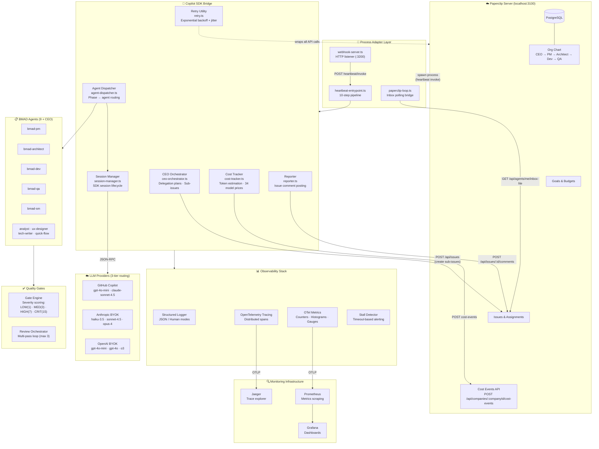
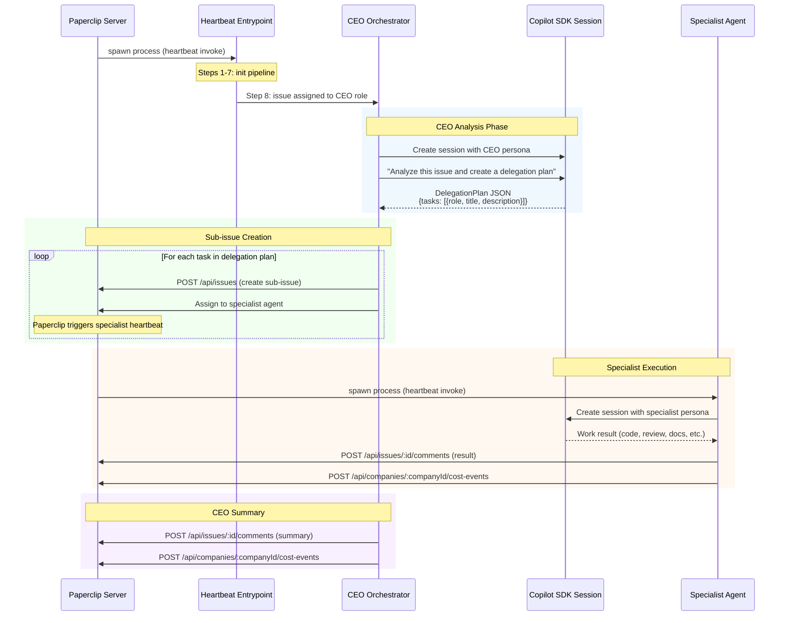

# BMAD Copilot Factory — Architecture

## System Overview



## Data Flow

### 1. Heartbeat Pipeline (10-step process)

Each Paperclip heartbeat spawns a Node.js process that executes the full 10-step pipeline in `src/heartbeat-entrypoint.ts`:

```
Step 1:  Extract Paperclip env (PAPERCLIP_URL, AGENT_API_KEY, COMPANY_ID)
Step 2:  Create PaperclipClient (REST API wrapper with retry)
Step 3:  Identify self (GET /api/agents/me → agent metadata)
Step 4:  Resolve BMAD role mapping (agent name → BmadAgent persona)
Step 5:  Check inbox (GET /api/agents/me/inbox-lite → assigned issues)
Step 6:  Load agent 4-file configuration (system prompt, tools, skills, MCP)
Step 7:  Bootstrap Copilot SDK (SessionManager + AgentDispatcher + CostTracker)
Step 8:  Process assigned issues (CEO delegates, specialists execute)
Step 9:  Report cost tracking data (native API + markdown comments)
Step 10: Cleanup (close sessions, flush telemetry)
```

### 2. CEO Orchestration Flow



### 3. Paperclip Issue Assignment → Agent Action (Push Model)

```
Paperclip server invokes heartbeat on agent
  ↓
Agent receives assigned issue via inbox or webhook callback
  (GET /api/agents/me/inbox-lite  or  POST webhook)
  ↓
Heartbeat Handler converts PaperclipIssue → HeartbeatContext
  ↓
Maps assignee → BmadAgent (e.g., "engineer" → bmad-developer)
  ↓
Creates Copilot SDK session with agent persona + tools
  ↓
Sends goal as prompt to agent session
  ↓
Agent uses tools (read files, write code, run tests)
  ↓
Result posted back as issue comment (POST /api/issues/:id/comments)
  ↓
Cost data reported (POST /api/companies/:companyId/cost-events)
```

**Integration modes:**
- **Inbox-polling bridge** (dev): Periodically checks `GET /api/agents/me/inbox-lite`
- **Webhook server** (prod): Paperclip calls `POST /heartbeat/invoke` → BMAD webhook on `:3200`

### 4. Story Lifecycle Flow

```
PM Agent                    PO Agent
  │                           │
  ├─ create-story tool        ├─ sprint-status tool
  │  └─ writes story.md      │  └─ prioritize backlog
  │  └─ status: backlog      │  └─ status: ready-for-dev
  │                           │
  ▼                           ▼
Dev Agent                   Review Agent
  │                           │
  ├─ dev-story tool           ├─ code-review tool
  │  └─ implements code       │  └─ adversarial review
  │  └─ status: review        │  └─ pass → done
  │                           │  └─ fail → fix-in-place
  │                           │  └─ 3 fails → escalate
```

## Directory Structure

```
src/
├── agents/          # BMAD agent persona definitions (9 agents)
│   ├── types.ts     # BmadAgent interface
│   ├── *.ts         # One file per role (PM, Arch, Dev, QA, SM, Analyst, UX, TechWriter, QuickFlow)
│   ├── registry.ts  # Agent lookup + allAgents array
│   └── index.ts     # Barrel exports
│
├── tools/           # Copilot SDK tool definitions (defineTool)
│   ├── types.ts     # BmadToolDefinition interface
│   ├── *.ts         # One file per tool
│   └── index.ts     # Barrel exports
│
├── adapter/         # Paperclip ↔ Copilot SDK bridge
│   ├── session-manager.ts    # CopilotClient wrapper with session lifecycle
│   ├── agent-dispatcher.ts   # Phase → agent routing, model selection, CostTracker integration
│   ├── ceo-orchestrator.ts   # CEO delegation: analyze → plan → sub-issues → summarize
│   ├── sprint-runner.ts      # Story lifecycle engine
│   ├── health-check.ts       # 5-probe system readiness check
│   ├── paperclip-client.ts   # REST client: issues, agents, cost-events, inbox
│   ├── paperclip-loop.ts     # Inbox-polling bridge
│   ├── heartbeat-handler.ts  # PaperclipIssue → BMAD dispatch bridge
│   ├── reporter.ts           # Issue comment posting
│   ├── retry.ts              # Exponential backoff with jitter (isPaperclipRetryable)
│   └── index.ts              # Barrel exports
│
├── skills/          # Copilot skills (prompt modules)
│   ├── bmad-methodology/skill.md
│   └── quality-gates/skill.md
│
├── mcp/             # MCP server definitions
│   ├── index.ts     # Barrel exports
│   └── bmad-sprint-server/
│       ├── index.ts # stdio MCP server entry point
│       └── tools.ts # 5 tool handlers (sprint, stories, arch docs)
│
├── observability/   # Production observability stack
│   ├── index.ts     # Barrel exports
│   ├── logger.ts    # Structured JSON/human-readable logger
│   ├── tracing.ts   # OpenTelemetry distributed tracing
│   ├── metrics.ts   # OTel counters, histograms, gauges
│   ├── cost-tracker.ts  # Token estimation, 34 model prices, budget tracking
│   └── stall-detector.ts  # Stuck story detection & alerting
│
├── quality-gates/   # BMAD adversarial review system
│   ├── types.ts     # Severity, findings, verdicts
│   ├── engine.ts    # Pure gate evaluation logic
│   ├── review-orchestrator.ts  # Multi-pass review loop
│   └── tool.ts      # Copilot SDK quality_gate_evaluate tool
│
├── config/          # Runtime configuration
│   ├── config.ts    # BmadConfig with env loading
│   └── model-strategy.ts  # Complexity→model tier routing
│
├── heartbeat-entrypoint.ts  # 10-step pipeline entry for Paperclip processes
├── webhook-server.ts        # HTTP server for Paperclip push-mode (:3200)
└── index.ts                 # Main entry point + CLI parsing

scripts/
├── setup-paperclip-company.ts  # Provision company, 10 agents, org chart in Paperclip
├── update-model-pricing.ts     # Manage LLM pricing (--show, --apply, --json)
├── e2e-smoke-invoke.ts         # E2E smoke test with cost verification
├── e2e-smoke.ts                # Basic connectivity smoke test
├── convert-bmad-agents.ts      # Auto-generate agent TS from BMAD templates
├── setup-paperclip.sh          # Clone + patch Paperclip repo
├── start-paperclip-native.sh   # Start Paperclip without Docker
└── reset-and-run-otel.sh       # Reset observability stack

test/                  # 333 tests across 16 files
```

## Observability Architecture

### Structured Logging

All modules use `Logger.child("component-name")` for structured output:
- **JSON mode** (`LOG_FORMAT=json`) — one JSON object per line, for Grafana Loki / log aggregators
- **Human mode** (`LOG_FORMAT=human`) — colored, timestamped, for local development

### Distributed Tracing (OpenTelemetry)

When `OTEL_ENABLED=true`, spans are exported via OTLP to Jaeger/Grafana Tempo:
```
sprint.cycle (root)
  ├── story.process (per story)
  │   └── agent.dispatch (per phase)
  └── quality_gate.evaluate (per review pass)
```

### Metrics (OpenTelemetry)

| Metric | Type | Description |
|--------|------|-------------|
| `bmad.stories.processed` | Counter | Stories processed by phase |
| `bmad.stories.done` | Counter | Stories reaching done |
| `bmad.agent.dispatch_duration` | Histogram | Agent dispatch latency (ms) |
| `bmad.review.passes` | Counter | Review passes executed |
| `bmad.gate.verdicts` | Counter | Gate verdicts by outcome |
| `bmad.sessions.active` | UpDownCounter | Active Copilot SDK sessions |
| `bmad.stall.detections` | Counter | Stalled stories detected |
| `bmad.sprint.cycles` | Counter | Sprint cycles executed |

### Stall Detection

Monitors stories stuck in a phase beyond configurable thresholds:
- `ready-for-dev`: 30 min (default)
- `in-progress`: 60 min (default)
- `review`: 30 min (default)

### Cost Tracking

The **CostTracker** (`src/observability/cost-tracker.ts`) estimates token usage and costs for every agent dispatch:

**Pricing database:** 34 model entries covering:
- Anthropic (claude-opus-4, sonnet-4.5, sonnet-4, haiku-3.5)
- OpenAI (o3, o4-mini, gpt-4o, gpt-4o-mini, gpt-4.1, gpt-4.1-mini, gpt-4.1-nano)
- Google (gemini-2.5-pro, gemini-2.5-flash, gemini-2.0-flash)
- Mistral, Meta, and default fallback pricing

**Dual-path reporting:**
| Path | API Endpoint | Format |
|------|-------------|--------|
| Native cost-events | `POST /api/companies/:companyId/cost-events` | `{ agentId, provider, model, inputTokens, outputTokens, estimatedCostUsd }` |
| Markdown comment | `POST /api/issues/:id/comments` | Human-readable `📊 Cost Report` table |

**Token estimation:** `estimateTokens(text)` uses 4 chars ≈ 1 token heuristic.
**Provider inference:** `inferProvider(model)` maps model name prefixes to providers.
**Integration:** Wired into `AgentDispatcher` (per-dispatch tracking), `ceo-orchestrator.ts` (CEO session), and `heartbeat-entrypoint.ts` (Step 9 reporting).

### Retry Utility

The **retry utility** (`src/adapter/retry.ts`) provides resilient API calls:
- `withRetry<T>(fn, options)` — exponential backoff with configurable jitter
- `isPaperclipRetryable(err)` — classifies errors as retryable (429, 500, 502, 503, 504, network errors)
- Default: 3 attempts, 1s base delay, 30s max delay
- Used for all Paperclip API calls (issue creation, comments, cost events)

### Model Strategy (BYOK Cost Routing)

Complexity-based model selection with 3 tiers:
| Tier | Copilot Model | BYOK Anthropic | BYOK OpenAI | Used For |
|------|--------------|----------------|-------------|----------|
| fast | gpt-4o-mini | claude-haiku-3.5 | gpt-4o-mini | Status checks, simple queries |
| standard | claude-sonnet-4.5 | claude-sonnet-4.5 | gpt-4o | Code generation, normal dev |
| powerful | claude-sonnet-4.5 | claude-opus-4 | o3 | Architecture, security audit |

## Key Design Decisions

| Decision | Rationale |
|----------|-----------|
| Copilot SDK over raw LLM calls | Built-in tools, MCP, session management, auto-compaction |
| Paperclip over custom orchestrator | Production-grade org charts, budgets, governance. Push model: Paperclip invokes heartbeats on agents. Company-scoped data model. Issues (not tickets). Results via issue comments. |
| CEO orchestrator pattern | CEO analyzes issues, creates delegation plans, spawns sub-issues for specialists. Enables multi-agent coordination without direct agent-to-agent communication. |
| Process-per-heartbeat model | Each heartbeat spawns an isolated Node.js process with its own 10-step pipeline. Clean lifecycle, no shared state between heartbeats. |
| Dual-path cost reporting | Native Paperclip cost-events API for structured data + markdown comments for human visibility. Both paths fire independently. |
| Retry with exponential backoff | All Paperclip API calls wrapped in `withRetry()` with jitter to handle transient failures (429, 5xx, network errors). |
| Skills over inline prompts | Reusable, versionable methodology as directory modules |
| Adversarial code review | BMAD's quality-gated loop prevents regressions |
| TypeScript throughout | Type safety for agent/tool interfaces, SDK is TS-first |
| ESM modules | Modern module system, tree-shakeable, SDK compatible |
| OpenTelemetry for observability | Vendor-neutral, exports to Jaeger/Grafana/Prometheus |
| Structured logging over console.log | Machine-parseable JSON for production, human-readable for dev |
| Complexity-based model routing | Optimizes cost: fast tier for simple tasks, powerful for complex |
| BYOK cost routing | Preserves Copilot quota for interactive work, routes batch to BYOK |
| Stall detection | Prevents stories stuck in a phase indefinitely; auto-escalation |
| Token estimation heuristic | 4 chars ≈ 1 token is fast and accurate enough for cost estimation (±20%). No tokenizer dependency needed. |

## CEO Orchestrator Details

The CEO orchestrator (`src/adapter/ceo-orchestrator.ts`) implements a structured delegation pattern:

1. **Issue Analysis**: CEO receives a Paperclip issue and creates a Copilot SDK session
2. **Delegation Prompt**: Builds a structured prompt asking the LLM to analyze the issue and produce a JSON delegation plan
3. **Plan Parsing**: `parseDelegationPlan(response)` extracts `DelegationPlan` with typed `DelegationTask[]`
4. **Agent Resolution**: `resolveAgentId(role, paperclipClient)` looks up Paperclip agent IDs by role name (cached)
5. **Sub-issue Creation**: For each task, creates a Paperclip issue and assigns it to the specialist agent
6. **Result Collection**: Specialist results flow back via issue comments
7. **Summary**: CEO posts a summary comment on the parent issue

```typescript
interface DelegationTask {
  role: string;        // e.g., "engineer", "architect", "qa"
  title: string;       // Sub-issue title
  description: string; // Detailed instructions for the specialist
}

interface DelegationPlan {
  analysis: string;    // CEO's understanding of the issue
  tasks: DelegationTask[];
}
```

## Paperclip Company Setup

The `scripts/setup-paperclip-company.ts` script automates full Paperclip provisioning:

1. **Verify prerequisites** — checks Paperclip server is reachable
2. **Reset existing agents** — terminates any agents from previous runs
3. **Create 10 agents** — CEO + 9 BMAD specialists with role-specific metadata
4. **Wire org chart** — sets `reportsTo` relationships (CEO at top)
5. **Set instruction paths** — points each agent to its 4-file configuration
6. **Verify setup** — prints org tree visualization

```
CEO (bmad-ceo)
├── PM (bmad-pm)
│   ├── Architect (bmad-architect)
│   └── Analyst (bmad-analyst)
├── Scrum Master (bmad-sm)
├── Developer (bmad-dev)
│   └── Quick-Flow (bmad-quick-flow)
├── QA (bmad-qa)
├── UX Designer (bmad-ux)
└── Tech Writer (bmad-tech-writer)
```

## Security Considerations

- **No secrets in code** — use environment variables and `.env` files
- **Copilot CLI auth** — uses `gh auth` token (never stored in repo)
- **BYOK optional** — can bring own API keys for alternative models
- **Docker isolation** — Paperclip runs in containers, not on host
- **Tool sandboxing** — Copilot CLI `--disallowed-tools` for production
- **Bearer auth** — all Paperclip API calls use agent API key in `Authorization` header
- **Process isolation** — each heartbeat runs in its own Node.js process

## Webhook Server

The webhook server (`src/webhook-server.ts`) provides a production-mode HTTP listener:

- **Port**: `WEBHOOK_PORT` env var (default: 3200)
- **Endpoints**:
  - `POST /heartbeat/invoke` — receives Paperclip heartbeat payloads
  - `GET /health` — liveness check
- **Graceful shutdown** on SIGTERM/SIGINT
- **Bearer auth validation** on incoming requests
- **Body parsing** with size limits

## Scaling Path

1. **Single agent**: One Copilot CLI instance, one agent at a time (current)
2. **Multi-agent**: Multiple heartbeat processes, each with own SDK session (CEO delegation)
3. **MCP integration**: External tool servers for specialized capabilities
4. **Full autonomous loop**: Paperclip governance with budget limits and cost tracking
5. **Multi-project**: Clipper preset distribution, webhook server fleet

## Paperclip API Surface

| Method | Endpoint | Description |
|--------|----------|-------------|
| `GET` | `/api/agents/me` | Agent self-identification |
| `GET` | `/api/agents/me/inbox-lite` | Check assigned issues |
| `GET` | `/api/agents` | List all agents in company |
| `POST` | `/api/agents` | Create new agent |
| `PATCH` | `/api/agents/:id` | Update agent metadata |
| `POST` | `/api/agents/:id/pause` | Pause agent |
| `POST` | `/api/agents/:id/resume` | Resume agent |
| `POST` | `/api/agents/:id/terminate` | Terminate agent |
| `GET` | `/api/issues` | List issues |
| `POST` | `/api/issues` | Create issue |
| `PATCH` | `/api/issues/:id` | Update issue |
| `POST` | `/api/issues/:id/comments` | Add comment to issue |
| `POST` | `/api/companies/:companyId/cost-events` | Report cost event |
| `GET` | `/health` | Server health check |
